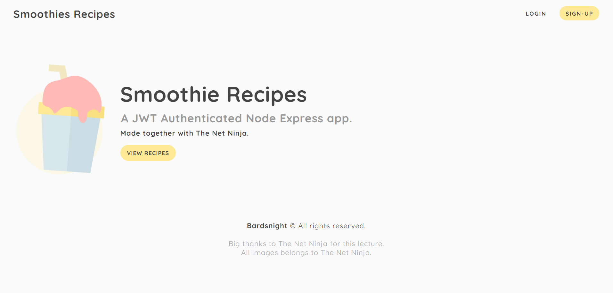

# A JWT Authenticated Node Express Application

Simple web-page made with Node and Express with MVC principles.  
The user is able to sign-up a new account and login to see the "Recipes" page.  
User credentials are stored in a NoSQL MongoDB database with hashed passwords using BCrypt.  
Session is kept with JWT tokens and authenticated in every request that needs it with middleware.  


## Live Preview  
To be done...


## How to run

### Setting up Environment Variables
First, clone the repository and create a ```.env``` file with the following data:
```
DB_URI=mongodb+srv://<username>:<password>@clustername.something.mongodb.net/<dbname>
PORT=3000
JWT_SECRET=bananas
```
- You can create a free database at [MongoDB Atlas Cloud Service](https://www.mongodb.com/cloud/atlas) and grab the connection string to your database.  
Make sure you change your **username**, **password** and **dbname** accordingly. Also, the `@cluster.something.mongodb.net` will be specific to your cluster that you will create at Atlas.  
- PORT doesn't need to be changed unless you need to.
- JWT_SECRET is used to generate JWT Tokens - that should be a secret string - you can change it to whatever you want.


### Installing dependencies
After you've setup your database string, you should install the dependencies using the following command at any command line interface.  
```npm install```
Make sure you run this command inside the Root Directory (node-express-jwt-auth/), where you can find the `package.json` file.  

### Running the application
To run the application, I use `nodemon` installed globally, but you can run it once using `npx nodemon app`.  
At `nodemon`, **app** refers to the app.js file that is used as the main file of this application.   

After running `nodemon`, you should expect your command line to show the following message:
`> server listening on port XXXX`  

#### If you open your browser and head to `localhost:port`, e.g. localhost:3000 at my server, you should see the following page:
  
 

#### `package.json` dependencies:
```json
dependencies": {
    "bcrypt": "^5.0.0",
    "cookie-parser": "^1.4.5",
    "dotenv": "^8.2.0",
    "ejs": "^3.1.3",
    "express": "^4.17.1",
    "jsonwebtoken": "^8.5.1",
    "mongoose": "^5.9.23",
    "validator": "^13.5.2"
  }
```
